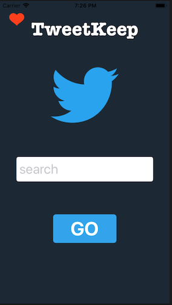
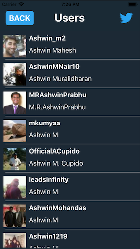
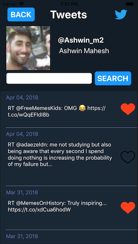
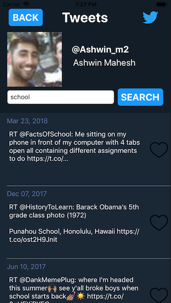
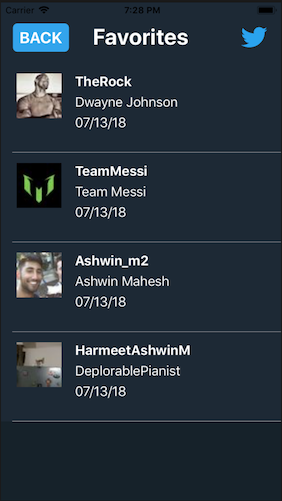
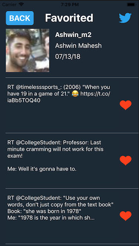

<h1>TweetKeep</h1>

<h3>TweetKeep is an iOS app that uses Twitter API to allow users to search for any twitter user by name or twitter handle.
A table will get populated with the top results. Once you select a user, you will get to see all of his or her tweets. You can then search for keywords within their tweets, which is a feature that twitter doesn't have. Additionally, users can select their favorite tweets to store in Core Data. This like will be seperate from Twitter's favoriting. If you click on the heart on the top left corner of the first page, you can then see all of your favorites. The first page organizes them by person. Once you select a person, you can then see all of their tweet's that you have favorited.</h3>

 
 
 

<h2>Created by Ashwin Mahesh, Andrew Skinner, Carlo Del Mundo</h2>
